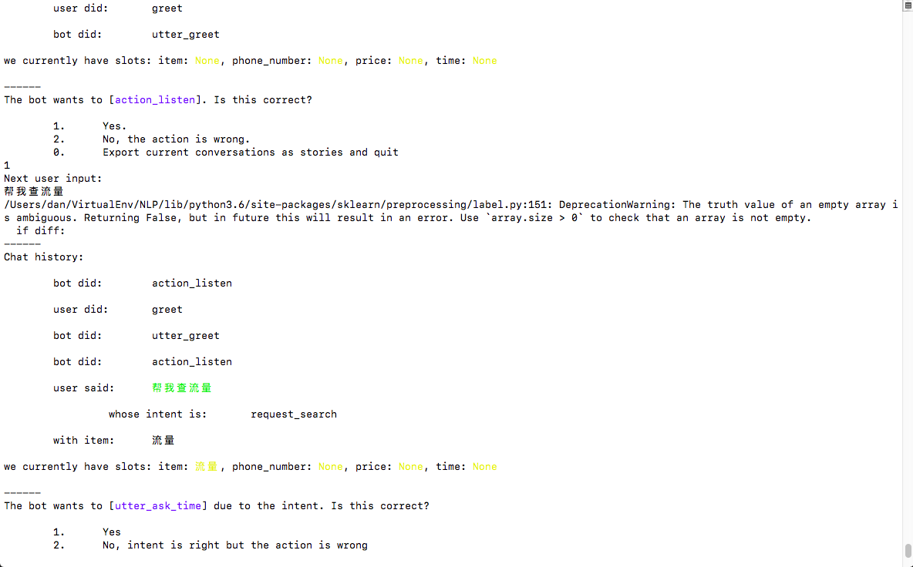

# 整理：基于Rasa-NLU和Rasa-Core的任务型ChatBot

## 组件版本
1. Python 3
2. TensorFlow 1.8.0
3. Keras 2.2.2
4. jieba 0.39
5. msgpack 0.5.6
6. scikit-learn 0.19.1
7. sklearn_crfsuite 0.3.6
8. spacy 2.0.17
9. rasa-nlu 0.13.8
10. rasa-core 0.10.4

## 资料来源
1. FastText预训练词向量，wiki训练，有两个版本可以选择，这里选择wiki训练的尺寸较小的版本，下载地址[https://s3-us-west-1.amazonaws.com/fasttext-vectors/wiki.zh.vec](https://s3-us-west-1.amazonaws.com/fasttext-vectors/wiki.zh.vec)
2. rasa-nlu和rasa-core示例配置和语料 来自：[https://github.com/zqhZY/_rasa_chatbot](https://github.com/zqhZY/_rasa_chatbot)
这里仅整理为一个完整的包含NLU、Dialog训练和测试，ChatBot在线学习和使用的例子。

## 准备工作
1. git clone https://github.com/Ma-Dan/rasa_bot
2. 下载FastText预训练词向量[wiki.zh.vec](https://s3-us-west-1.amazonaws.com/fasttext-vectors/wiki.zh.vec)
下载后运行下列命令准备词向量
python -m spacy init-model zh rasr_bot/spacy/wiki_zh --vectors-loc wiki.zh.vec
3. 当前版本rasa-nlu的jieba_tokenizer存在重复加载用户字典问题，使用[最新版](https://github.com/RasaHQ/rasa_nlu/raw/master/rasa_nlu/tokenizers/jieba_tokenizer.py)覆盖site-packages/rasa_nlu/tokenizers下的jieba_tokenizer.py
3. （可选）使用自己训练的FastText词向量，或其他工具训练的词向量

## 训练和测试
### Rasa-NLU训练
```shell
python bot.py train-nlu
> INFO:rasa_nlu.training_data.loading:Training data format of data/nlu.json is rasa_nlu
> INFO:rasa_nlu.training_data.training_data:Training data stats: 
> 	- intent examples: 169 (13 distinct intents)
> 	- Found intents: 'inform_other_phone', 'inform_current_phone', 'unknown_intent', 'goodbye', 'thanks', 'inform_time', 'inform_item', 'greet', 'request_management', 'confirm', 'inform_package', 'deny', 'request_search'
> 	- entity examples: 102 (4 distinct entities)
> ...
> Part I: train segmenter
> ...
> Part II: train segment classifier
```
### Rasa-NLU测试(API调用测试，可用于前端程序调用Rasa-NLU服务)
```shell
python -m rasa_nlu.server -c data/nlu_model_config.json --path models
curl -XPOST localhost:5000/parse -d '{"q":"你好", "project":"ivr", "model":"demo"}'
```
### Rasa-Core训练
```shell
python bot.py train-dialogue
```
### Rasa-Core测试(API调用测试，可用于前端程序调用ChatBot服务)
```shell
python -m rasa_core.server -p 5005 -d models/dialogue -u models/ivr/demo -o out.log
curl -XPOST localhost:5005/conversations/default/parse -d '{"query":"帮我查话费"}'
curl -XPOST localhost:5005/conversations/default/continue -d '{"executed_action": "utter_greet", "events": []}'
```
### ChatBot测试(命令行直接跟ChatBot对话)
```shell
python bot.py run
```

### ChatBot在线学习(命令行交互训练ChatBot对话)
```shell
python bot.py run online-train
```

